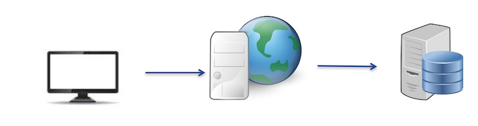
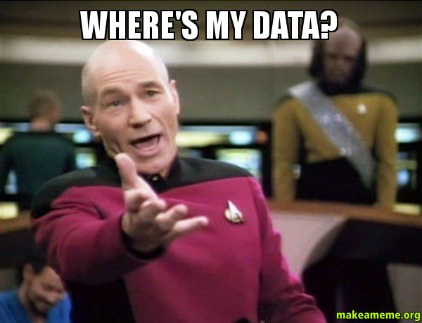
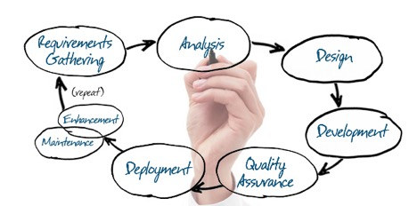
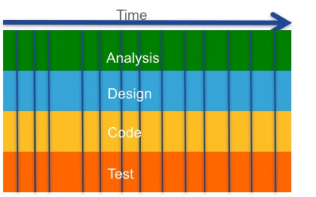
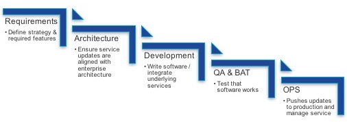
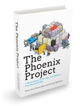
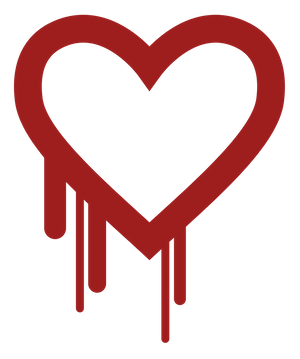

[item]: # (slide)

# Module: General Development Concepts

[item]: # (/slide)

## Abstract

Developing software involves much more than simply programming languages and APIs.  Or more accurately, the process of effectively developing software requires an understanding of more than just "coding".  In this module we will explore four topics that are fundamental to any successful development project.  These topics are: Application Architecture, Software Development Lifecycle, Application Operations, and OpenSource Licenses.  

### Presentation Slides

A slide show version of this presentation is available at this link: [General Development Concepts Slides](https://rawgit.com/imapex-training/mod_general_development_concepts/master/output/index.html#/)

[item]: # (slide)
## Main Topics

### Concepts
* [Application Architecture](#application-architecture)
* [Software Development Lifecycle](#software-development-lifecycle)
* [Application Operations](#application-operations)
* [OpenSource Licenses](#opensource-licenses)

[item]: # (/slide)

[item]: # (slide)

## Application Architecture

[item]: # (/slide)

**Architecture** - *the complex or carefully designed structure of something*

Software architecture is the structure of an information system consisting of entities their properties, and the relationships among them. There are many ways an application can be architected, and the leading architecture of the time changes.  

Till recently, the leading software architecture was commonly referred to as *Client-Server* and is still quite popular and used in many active development projects.  With the advent of "cloud" and the explosion of technology and applications throughout our personal and professional worlds, a new architecture called *Micro-Service* has arisen and become quite popular.  

[item]: # (slide)

## Traditional Client-Server Architecture

[item]: # (/slide)

For years Client-Server Applications have been the foundation of business.  ERPs, CRMs, Medical Records, Warehouse Management, Point of Sale, etc have all been built with this architecture in mind.  Web/App/Data is another way of referring to this architectural model.  This architecture can be broken into three common components.  

First, is the Presentation Layer which is the "client" in client/server.  This is how end users interact with the application.  This interaction could be via a *thick client* application installed onto a workstation, or, more common in recent times, a web interface.  In this architecture, there is tyipcally a single application/website with which end users interact with the application.

Secondly is the Application Layer which would be the "server" in client/server.  Here is where the business logic for the application is all handled.  Though some large applications may have multiple application servers in the architecture, most applications look to minimize the number of application servers to the minimum needed to provide the needed logic.  Few, but large and powerful application servers is quite common.  

Lastly is the Data Layer.  With client/server applications you will typically find a single Relational Database (common options would be Microsoft SQL Server, Oracle, or MySQL) that stores all the data processed and leveraged by clients of the application.  

In some applications you will find the application and data layers installed on a single server instance, or they may be seperated onto different servers and communicate over the network.  

There are some key reasons this Architecture worked so well for so long.  

* For years application designers knew exactly who their users were, where they were coming from, and how many there might be.  
* Business logic, and therefore applications, didn't change that often.  This meant that maintaining a small number of complex systems was seen as the *simple* option.  
* The data that was interesting and tracked was transactional and contained clear boundaries and relationships.  

[item]: # (slide)

## Micro-Service Architecture

[item]: # (/slide)

Today, most modern applications (also commonly called Cloud Native, or Cloud Born) are designed using a Micro-service Architecture.  It is easiest to understand micro-service architecture as a comparison to the commonly understood Client-Server.  

Rather than have a single client providing the presentation layer for users, micro-service applications are designed with the understanding that the method users will interact with the application will be varied and change over time.  Forcing a user to install software onto their computer or use a web page from a computer today is a way to nearly gaurantee your applciation to fail today.  Users are demanding Mobile-First options across a wide variety of device types.  Wearable technology like smartwatches are also becoming popular and mastering this interface will be important for developers.  And then are the even more bleeding edge interfaces like voice and virtual reality.  Micro-service applciations are designed to make it easy to launch new interfaces for users quickly and easily.  

In a micro-service application, the business logic elements are deconstructed into small, self-contained elements that can be developed, deployed and managed independent of each other.  This aspect of the architecture is where the term *micro-service* comes from.  Each micro-service provides capabilities through a consistent and well documented API (mostly commonly today REST) to other micro-services or directly to client applications.  Developers are still striving for simplicity, and because of how quickly the application requirements change, this architecture provides simplicity by allowing each element of the application to evolve independent of each other.  

But this architecture comes with a price.  Micro-service architecture offers new challenges that Client-Server lacks.  Examples include: 

* Loosely couple components and development teams require extra effort be made related to API development and documentation 
* The underlying network is even more important as a single request from a user could generate hundreds of transactions 
* With each service providing an exposed interface and attack vector, security must be considered even more 
* Tracking addresses and identities for services in a scalable fashion 
* Operational challenges of a quickly changing, highly distrubted application pressure traditional models

And finally, the data leveraged in a modern application is very different from the single relational database of a traditional application.  Big Data is throughout these applicaitons, and a single application may pull in data from a dozen or more differnet data sources, some of which may not even be owned or controlled by the application owner themselves.  

[item]: # (slide)
## The 12 Factor Application

[item]: # (/slide)

[item]: # (slide)
## What is a "12 Factor" App and where did it come from

Full details at [12Factor.net](http://12factor.net) 

[item]: # (/slide)

The 12 Factor Application is a methodology proposed in the early 2010s by core members of the Heroku team.  It is a well circulated and read proposal that focuses on "Cloud Native" application design concepts, however it is not perfect or univerally accepted.  Most will agree that it provides an ideal to strive towards, and a _violation_ of a factor should be done consciously and with reason.  

It is not the only _manifesto_ on Cloud Native development, but it is worth having exposure and understanding of.  

[item]: # (slide)
## The Factors 

### I. [Codebase](http://12factor.net/codebase)
One codebase tracked in revision control, many deploys

### II. [Dependencies](http://12factor.net/dependencies)
Explicitly declare and isolate dependencies

### III. [Config](http://12factor.net/config)
Store config in the environment

### IV. [Backing services](http://12factor.net/backing-services)
Treat backing services as attached resources

[item]: # (/slide)
[item]: # (slide)

### V. [Build, release, run](http://12factor.net/build-release-run)
Strictly separate build and run stages

### VI. [Processes](http://12factor.net/processes)
Execute the app as one or more stateless processes

### VII. [Port binding](http://12factor.net/port-binding)
Export services via port binding

### VIII. [Concurrency](http://12factor.net/concurrency)
Scale out via the process model

[item]: # (/slide)
[item]: # (slide)

### IX. [Disposability](http://12factor.net/disposability)
Maximize robustness with fast startup and graceful shutdown

### X. [Dev/prod parity](http://12factor.net/dev-prod-parity)
Keep development, staging, and production as similar as possible

### XI. [Logs](http://12factor.net/logs)
Treat logs as event streams

### XII. [Admin processes](http://12factor.net/admin-processes)
Run admin/management tasks as one-off processes

[item]: # (/slide)

[item]: # (slide)
## A Stateless Aspiration

[item]: # (/slide)

The 12 Factor Application describes a goal of a **stateless application**.  The refers to the goal that applications (and their components) should be able to come and go without any overall impact to the user or data.  This is core to the ablity to be fully "cloud native" and drive towards fully automated operations and portablity.  

This is a great target goal, and for many applications, or microservices within an application, it is useful and practical.  But as an overall strategy it has some significant problems that are important to be aware of.  

### Where's the data?

[item]: # (slide)

[item]: # (/slide)

Nearly every application of significance has a need to gather, manipulate, store, and report on data.  At it's core, the 12 Factor principals do not accomidate for how to deal with data. 

[item]: # (slide)

## Software Development Lifecycle

[item]: # (/slide)

The Software Development Lifecycle (SDLC) is the process an application development team follows to build their application.  There are many many SDLC methologies including:

* Waterfall
* Prototyping
* Rapid Application Development
* Extreme Programming
* Agile

SDLC is different from Application Architecture, and though there are common pairings between architecture and methodology, you could pair them up however you want.  

[item]: # (slide)

## Waterfall Methodology

[item]: # (/slide)

The Waterfall Methodology has been around since the 50's and is still widely leveraged today.  A key aspect of Waterfall projects is that the requirements and scope are determined at the very beginning of the project, and all effort proceeds logically from concept to finished progress to achieve the project goal.  

Waterfall was originally developed at a time when the effort to actually build and test software was very expensive and time consuming.  This lead to project teams spending a great deal of time upfront ensuring they completely understood the goals and scope so that once they began the development they would have the clear focus on what was to be built.  Experimentation, idea gathering, and creativity is front-loaded in a Waterfall project.  

[item]: # (slide)

## Waterfall Timeline

[item]: # (/slide)

Time is always linear, and across the time of a waterfall project the team moves from one phase to the next until complete.  A major critism of Waterfall projects is that projects often fall behind schedule and there are delays in shipping products.  This can often result in time being sacraficed from the Test phase, which can lead to software quality issues.  

A key point to note here as we move into Agile Development, is that after 50% of time has been spent on a project, no code has been written, and no product exists.  

[item]: # (slide)

## Agile Development

[item]: # (/slide)

Agile development is quite different from Waterfall, and reflects the nature of the more modern state of application development and business expectations.  Agile projects focus on some two value points:

* Requirements change quickly
* Get to market fast

It isn't that these weren't also true in the 50s, the difference is that the state of technology allows for developers to change their behavior to meet them better today.  The cost in time and money to do the actual development is a fraction of what it used to be, so organizations can afford to experiment when developing and coding, and potentially throw away code that doesn't work.  

### Key Agile Terms

* User Story
    * A user story is a tool used in Agile software development to capture a description of a software feature from an end-user perspective. The user story describes the type of user, what they want and why. A user story helps to create a simplified description of a requirement.
    * Source: [What is a User Story?](http://searchsoftwarequality.techtarget.com/definition/user-story)
* Sprint
    * In product development, a sprint is a set period of time during which specific work has to be completed and made ready for review.
    * Source: [Sprint](http://searchsoftwarequality.techtarget.com/definition/Scrum-sprint)
* Scrum
    * In the Scrum method of Agile software development, work is confined to a regular, repeatable work cycle, known as a sprint or iteration. Scrum sprints used to be 30 days long, but today we advise one-week or two-week sprints. ... Scrum is iterative and incremental.
    * Source: [Scrum Sprint](http://searchsoftwarequality.techtarget.com/definition/Scrum-sprint)
* Standup
    * The daily stand-up meeting (also known as a "daily scrum", a "daily huddle", "morning roll-call", etc.) is simple to describe: The whole team meets every day for a quick status update. We stand up to keep the meeting short.
    * Source: [It's Not Just Standing Up: Patterns for Daily Standup Meetings](http://martinfowler.com/articles/itsNotJustStandingUp.html)
* Minimum Viable Product (MVP)
    * The Minimum Viable Product. The minimum viable product (MVP), as defined by Eric Ries, is a learning vehicle. It allows you to test an idea by exposing an early version of your product to the target users and customers, to collect the relevant data, and to learn from it.
    * Source: [The Minimum Viable Product & the Minimal Marketable Product](http://www.romanpichler.com/blog/minimum-viable-product-and-minimal-marketable-product/)

[item]: # (slide)

## Agile Timeline

[item]: # (/slide)

Time is still linear in an Agile project, but the way the time is used differs greatly.  Within each Sprint, the developers perform the Analysis, Design, Code and Testing needed to deliver the User Stories that make up the Sprint.  And at any point in time, there is a feasibly shippable product.  

[item]: # (slide)

## Application Operations

[item]: # (/slide)

[item]: # (slide)

## Traditional Operations

[item]: # (/slide)

Traditional IT Operations are organized around different teams focusing on one element of the overall goal.  Business leaders determine what is needed, Enterprise Architects take the goals from the leaders and design a solution.  Developers build the products.  QA engineers test to make sure it operates as designed.  And lastly the Operations teams implement and maintain the solution.  

This orgainziation structure and culture has lead to several very funny memes, but they tend to focus on the truth of the divided nature of IT delivery, and the challenges that it causes in accountability and success.

[item]: # (slide)

## DevOps

[item]: # (/slide)

DevOps is a new operations model focused on leveraging some of the best techniques from Agile and Lean to combine Development and Operations (and often test/QA) into a single team that is responsible for the full delivery of a software solution.  

DevOps brings accountabilty for software together in a mindset of "If you build it, you own it".  

The Guiding principals of DevOps include: 

* Culture
* Automation
* Lean
* Metrics 
* Sharing

[item]: # (slide)

> “[DevOps is] a set of cultural norms and technical practices that enable this fast flow of work from dev through test through operations while preserving world class reliability” 
> ~ Gene Kim - author of “The Phoenix Project”
[item]: # (/slide)

DevOps is often talked about in the nature of the tools and techniques that are implemented as part of a pipeline, but DevOps is much more about the culture of an organization than about whether they are leveraging Jenkins.  

[item]: # (slide)
# Why do we Care? 

[item]: # (/slide)

Software development is like any other area of IT.  There are basic capabilities and technologies, then there are strategies for using them.  When we want to be relevant to network engineers, we study strategies and design with "3 Tier Network Architectures" and more recently "Spine-Leaf" in mind.  When we want to be relevant to software developers, we need to understand the common practices and methods to engage in discussions.  

[item]: # (slide)
## A sidebar on Secrets

[item]: # (/slide)

In development a "secret" can loosely be defined as anything you wouldn't want everyone else in the world to know.  This includes the obvious things like: 

[item]: # (slide)
### Obvious Secrets 

* Passwords 
* Authentication Tokens
* Usernames 
* Credit Card
* Account Information 

[item]: # (/slide)

But it can also include things that aren't as directly damaging if they are lost such as: 

[item]: # (slide)
### Also Secrets

* Application and Server Names 
* API Endpoints and addresses 
* Email Addresses 
* IP Addresses and Port Numbers
* Domain Names 
* just about anythind descriptive about your environment... 

[item]: # (/slide)

**Factor III: Config** talks about NOT including environment details in your code, but rather in the environment.  In many cases the "environment details" also qualify as **secrets** and you need to take care about how you are storing and transporting them throughout application development and deployment process.  It is very easy to commit secrets into a codebase (ie GitHub) and mistakeningly make your usernames and passwords publicly available on GitHub.

[item]: # (slide)
### Cautionary Tail... 

* Example of what can happen: [$6,000 AWS Bill Overnight](https://wptavern.com/ryan-hellyers-aws-nightmare-leaked-access-keys-result-in-a-6000-bill-overnight)
* Handy reference on what to do: [Remove sensitve data from GitHub](https://help.github.com/articles/remove-sensitive-data/)

[item]: # (/slide)

[item]: # (slide)
## Links 

### Application Architecture 
* [http://12factor.net](http://12factor.net)
* [https://cncf.io](https://cncf.io)

### Software Development Lifecycle
* [http://www.agilemanifesto.org](http://www.agilemanifesto.org)

### Application Operations
* [http://www.realgenekim.me](http://www.realgenekim.me)
* [https://aws.amazon.com/devops/what-is-devops/](https://aws.amazon.com/devops/what-is-devops/)

[item]: # (/slide)

[item]: # (slide)
# OpenSource 

[item]: # (/slide)

[item]: # (slide)
## What is OpenSource 

>"Open source software is software with source code that anyone can inspect, modify, and enhance." 
>~ [OpenSource.com](https://opensource.com/resources/what-open-source) 

[item]: # (/slide)

[item]: # (slide)
##Is OpenSource "Free"?

[item]: # (/slide)

No... sorta... not really... 

OpenSource licenses often require the software be free to distribute, but there is typically no limitation on charging for Support, Installation, Troubleshooting, etc.  ie RedHat's Model 

Also, developing OpenSource software is no simpler than developing proprietary software.  Some projects are done as side projects, but many are done by paid programmers.  

[item]: # (slide)
## Why do people like OpenSource? 

* Control
* Training
* Security
* Stability 

[item]: # (/slide)

Lots of reasons... many cite

[item]: # (slide)
## Is OpenSource inherintly better, more stable, more secure?  

[item]: # (/slide)

[item]: # (slide)

Nope... remember [Heartbleed](https://en.wikipedia.org/wiki/Heartbleed)

[item]: # (/slide)

[item]: # (slide)
## Considerations for Choosing a License

* Permissions
* Conditions
* Limitations

[item]: # (/slide)

Any software product has a "license" that is attached.  We see and agree to these licenses all the time, but we've become so accustomed to "Click to accept" that we don't even realize it.  

With OpenSource Projects, you could write your own license that said whatever you wanted, but that's kinda boring.  So there are several available options that are often used.  

Licenses will typically address the above characteristics. And their treatment of each often determines what license makes sense for a project.  

[item]: # (slide)

### Permissions
***What are you allowed to do...***

* **Use - Commercial vs Private**
	* Can you use the software to make money
* **Distribution**
	* Are you allowed to freely distribute the software
* **Modification**
	* Are you allowed to change the software
* **Patent Use**
	* Can you use the software as part of a patent

[item]: # (/slide)

[item]: # (slide)
### Conditions
***What must you do...*** 

* **OpenSource** 
	* Actually provide the source code 
* **License and Copyright Notificaitons** 
	* Clearly indicate that you are using the licensed products 
* **Copyleft**
	* Whether other products, products must use the same license 
* **State Changes**
	* Explicitly state all changes  

[item]: # (/slide)

[item]: # (slide)

### Limiations
***Protections and other footnotes***

* **Liability**
	* Whether the creator can be held liable for damages
* **Trademark Use**
	* Usage related to trademarking. 

[item]: # (/slide)

[item]: # (slide)

## Some Common Licenses 

* [MIT License](http://choosealicense.com/licenses/mit/)
* [GNU GPL License](http://choosealicense.com/licenses/gpl-3.0/)
* [GNU LGPL License](http://choosealicense.com/licenses/lgpl-3.0/)
* [Apache License](http://choosealicense.com/licenses/apache-2.0/)

[item]: # (/slide)

### MIT license
A short and simple permissive license with conditions only requiring preservation of copyright and license notices. Licensed works, modifications, and larger works may be distributed under different terms and without source code.

[MIT License](http://choosealicense.com/licenses/mit/)

### GNU General Public License (GPL)
Permissions of this strong copyleft license are conditioned on making available complete source code of licensed works and modifications, which include larger works using a licensed work, under the same license. Copyright and license notices must be preserved. Contributors provide an express grant of patent rights.

[GNU GPL License](http://choosealicense.com/licenses/gpl-3.0/)

### GNU Library or "Lesser" General Public License (LGPL)
Permissions of this copyleft license are conditioned on making available complete source code of licensed works and modifications under the same license or the GNU GPLv3. Copyright and license notices must be preserved. Contributors provide an express grant of patent rights. However, a larger work using the licensed work through interfaces provided by the licensed work may be distributed under different terms and without source code for the larger work.

[GNU LGPL License](http://choosealicense.com/licenses/lgpl-3.0/)

### Apache License 2.0
A permissive license whose main conditions require preservation of copyright and license notices. Contributors provide an express grant of patent rights. Licensed works, modifications, and larger works may be distributed under different terms and without source code.

[Apache License](http://choosealicense.com/licenses/apache-2.0/)

[item]: # (slide)
# Links (and sources)

* [https://opensource.com/resources/what-open-source](https://opensource.com/resources/what-open-source)
* [https://en.m.wikipedia.org/wiki/Comparison_of_free_and_open-source_software_licenses](https://en.m.wikipedia.org/wiki/Comparison_of_free_and_open-source_software_licenses)
* [http://choosealicense.com/licenses/](http://choosealicense.com/licenses/)
* [https://opensource.com/education/12/7/clearing-open-source-misconceptions](https://opensource.com/education/12/7/clearing-open-source-misconceptions)

[item]: # (/slide)

[item]: # (slide)
# Why Do We Care? 

[item]: # (/slide)

OpenSource has always been popular, but its popularity is raising at a very fast level.  We are seeing large enterprises, across verticles, embracing OpenSource Software like never before.  And this is in some very critical areas where traditionally they would have selected a more traditional commercial vendor.  Even commercial software vendors, traditionally very anti-OpenSource, are starting to embrace OpenSource in a big way.  This could be as a user, contributor, or initiator of projects.  

Not all OpenSource projects and licenses are the same though, and as you jump into this world as an individual, you need to be able to differentiate between the different licenses that you'll run into so you can make apprporiate decisions about which projects to use and contribute to.  Also, deciding on an appropriate license for your own projects is an important decision that can have significant consequenses.  

[item]: # (slide)
## Go Do It Exercises 

Look at some popular OpenSource projects and find the license that they are published under.  Here are some ideas, but feel free to look elsewhere.  

* Ubuntu
* Apache
* HA-Proxy
* Cisco Mantl
* Terraform
* Vagrant
* Cisco Contiv

[item]: # (/slide)

